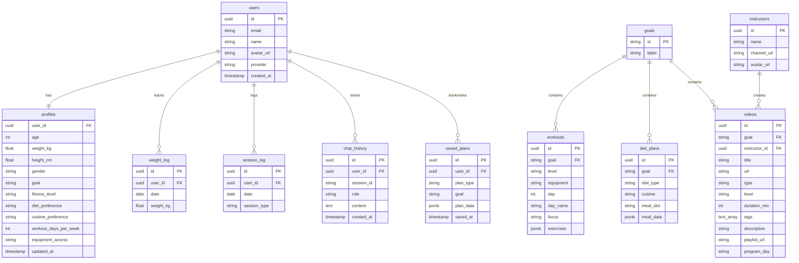

# Data Architecture — FitCoach AI

## Overview

This document describes the data model, storage strategy, and migration plan from the current JSON/session-state approach to a Supabase Postgres database with per-user data isolation.

## High-Level Data Flow

```
User → Supabase Auth (Google/GitHub)
         │
         ▼
   ┌─────────────┐
   │   profiles   │ ← user fills sidebar form
   │  weight_log  │ ← daily weight entries
   │  session_log │ ← auto-logged on each visit
   │ chat_history │ ← every message persisted
   │  saved_plans │ ← user bookmarks a plan
   └──────┬──────┘
          │ user_id scopes all queries
          ▼
   ┌─────────────┐
   │  ADK Agent   │
   │  (Gemini)    │
   └──────┬──────┘
          │ tool calls
          ▼
   ┌─────────────────────────────┐
   │   workouts  │  diet_plans   │  read-only reference data
   │   videos    │  instructors  │  JSON now, DB later
   └─────────────────────────────┘
```

## Entity Relationship Diagram



## Table Details

### User-Scoped Tables (per-user data)

#### `users`

Managed by Supabase Auth. Created automatically on first login.

| Column | Type | Notes |
|--------|------|-------|
| `id` | uuid | PK, from Supabase Auth |
| `email` | text | |
| `name` | text | From OAuth metadata (`full_name` or `user_name`) |
| `avatar_url` | text | Profile picture from Google/GitHub |
| `provider` | text | `google` or `github` |
| `created_at` | timestamptz | Auto |

#### `profiles`

One-to-one with `users`. Stores fitness preferences from the sidebar form.

| Column | Type | Constraint | Notes |
|--------|------|------------|-------|
| `user_id` | uuid | PK, FK → users.id | |
| `age` | int | 14–80 | |
| `weight_kg` | float | 30–200 | |
| `height_cm` | float | 100–220 | |
| `gender` | text | `male`, `female` | Used for BMR/TDEE calculations |
| `goal` | text | enum | `fat_loss`, `weight_gain`, `muscle_building`, `health_maintenance` |
| `fitness_level` | text | enum | `beginner`, `intermediate`, `advanced` |
| `diet_preference` | text | enum | `vegetarian`, `non_vegetarian`, `vegan`, `eggetarian` |
| `cuisine_preference` | text | enum | `indian`, `western`, `flexible` |
| `workout_days_per_week` | int | 3–6 | |
| `equipment_access` | text | enum | `none`, `basic`, `full_gym` |
| `updated_at` | timestamptz | Auto | |

#### `weight_log`

Daily weight entries for progress tracking.

| Column | Type | Notes |
|--------|------|-------|
| `id` | uuid | PK |
| `user_id` | uuid | FK → users.id |
| `date` | date | Unique per user per day |
| `weight_kg` | float | |

#### `session_log`

Tracks daily app usage for streak calculation.

| Column | Type | Notes |
|--------|------|-------|
| `id` | uuid | PK |
| `user_id` | uuid | FK → users.id |
| `date` | date | Unique per user per day |
| `session_type` | text | `app_visit`, `workout_logged`, `diet_logged` |

#### `chat_history`

Persists conversation across sessions and devices.

| Column | Type | Notes |
|--------|------|-------|
| `id` | uuid | PK |
| `user_id` | uuid | FK → users.id |
| `session_id` | text | Groups messages by conversation |
| `role` | text | `user` or `assistant` |
| `content` | text | Message body (markdown) |
| `created_at` | timestamptz | Auto |

#### `saved_plans`

User-bookmarked workout or diet plans.

| Column | Type | Notes |
|--------|------|-------|
| `id` | uuid | PK |
| `user_id` | uuid | FK → users.id |
| `plan_type` | text | `workout` or `diet` |
| `goal` | text | Which goal this plan targets |
| `plan_data` | jsonb | Full plan snapshot |
| `saved_at` | timestamptz | Auto |

### Reference Data Tables (shared, read-only)

#### `goals`

| Column | Type | Notes |
|--------|------|-------|
| `id` | text | PK — `fat_loss`, `weight_gain`, `muscle_building`, `health_maintenance` |
| `label` | text | Display name — `Fat Loss`, `Weight Gain`, etc. |

#### `workouts`

Flattened from the current nested JSON structure.

| Column | Type | Notes |
|--------|------|-------|
| `id` | uuid | PK |
| `goal` | text | FK → goals.id |
| `level` | text | `beginner`, `intermediate`, `advanced` |
| `equipment` | text | `none`, `basic`, `full_gym` |
| `day` | int | Day number in the program |
| `day_name` | text | e.g. `Monday` |
| `focus` | text | e.g. `Chest & Biceps` |
| `exercises` | jsonb | Array of `{name, sets, reps, rest_sec, muscle_group, equipment}` |

#### `diet_plans`

Flattened from the current nested JSON structure.

| Column | Type | Notes |
|--------|------|-------|
| `id` | uuid | PK |
| `goal` | text | FK → goals.id |
| `diet_type` | text | `vegetarian`, `non_vegetarian`, `vegan`, `eggetarian` |
| `cuisine` | text | `indian`, `western` |
| `meal_slot` | text | `breakfast`, `lunch`, `dinner`, `snacks` |
| `meal_data` | jsonb | `{name, calories, protein_g, carbs_g, fat_g, ingredients, prep_time_min}` |

#### `videos`

| Column | Type | Notes |
|--------|------|-------|
| `id` | uuid | PK |
| `goal` | text | FK → goals.id |
| `instructor_id` | uuid | FK → instructors.id, nullable |
| `title` | text | |
| `url` | text | YouTube URL |
| `type` | text | `workout`, `diet`, `supplement`, `overview` |
| `level` | text | `beginner`, `intermediate`, `advanced`, `all` |
| `duration_min` | int | |
| `tags` | text[] | Postgres array |
| `description` | text | |
| `playlist_url` | text | Nullable |
| `program_day` | text | Nullable, e.g. `Monday` |

#### `instructors`

| Column | Type | Notes |
|--------|------|-------|
| `id` | uuid | PK |
| `name` | text | e.g. `Guru Mann` |
| `channel_url` | text | YouTube channel link |
| `avatar_url` | text | Nullable |

## Enum Values

| Enum | Values |
|------|--------|
| Goal | `fat_loss`, `weight_gain`, `muscle_building`, `health_maintenance` |
| Fitness Level | `beginner`, `intermediate`, `advanced` |
| Diet Preference | `vegetarian`, `non_vegetarian`, `vegan`, `eggetarian` |
| Cuisine | `indian`, `western`, `flexible` |
| Equipment | `none`, `basic`, `full_gym` |
| Content Type | `workout`, `diet`, `supplement`, `overview`, `both` |
| Session Type | `app_visit`, `workout_logged`, `diet_logged` |

## Migration Plan

### Current State → Target State

| Data | Current Storage | Target Storage | Phase |
|------|----------------|----------------|:-----:|
| User identity | Supabase Auth | Supabase Auth (no change) | — |
| User profile | `st.session_state` | `profiles` table | 1 |
| Weight log | `user_history.json` | `weight_log` table | 1 |
| Session dates | `user_history.json` | `session_log` table | 1 |
| Chat messages | `st.session_state["messages"]` | `chat_history` table | 1 |
| Workouts | `data/workouts/*.json` | JSON files (no change) | — |
| Diet plans | `data/diet_plans/*.json` | JSON files (no change) | — |
| Videos | `data/youtube_videos/*.json` | JSON files (no change) | — |
| Saved plans | Does not exist | `saved_plans` table | 2 |
| Instructors | Embedded in video JSON | `instructors` table | 2 |
| Workouts in DB | — | `workouts` table | 3 |
| Diets in DB | — | `diet_plans` table | 3 |
| Videos in DB | — | `videos` table | 3 |

### Phase 1 — User Data Persistence

Migrate all per-user data to Supabase Postgres. Users get cross-device access, streaks survive browser clears, chat history persists.

### Phase 2 — Enhanced Features

Add `saved_plans` and `instructors` tables. Users can bookmark plans, browse by instructor.

### Phase 3 — Full DB Migration

Move reference data (workouts, diets, videos) from JSON to Postgres. Enables admin panel, dynamic content updates, and search/filter queries.

## Row Level Security (RLS)

All user-scoped tables must have RLS enabled:

```sql
-- Example for profiles
ALTER TABLE profiles ENABLE ROW LEVEL SECURITY;

CREATE POLICY "Users can read own profile"
  ON profiles FOR SELECT
  USING (auth.uid() = user_id);

CREATE POLICY "Users can update own profile"
  ON profiles FOR UPDATE
  USING (auth.uid() = user_id);

CREATE POLICY "Users can insert own profile"
  ON profiles FOR INSERT
  WITH CHECK (auth.uid() = user_id);
```

Apply similar policies to `weight_log`, `session_log`, `chat_history`, and `saved_plans`.

Reference data tables (`goals`, `workouts`, `diet_plans`, `videos`, `instructors`) should be read-only for authenticated users:

```sql
CREATE POLICY "Authenticated users can read"
  ON workouts FOR SELECT
  TO authenticated
  USING (true);
```

## Indexes

```sql
CREATE INDEX idx_weight_log_user_date ON weight_log(user_id, date DESC);
CREATE INDEX idx_session_log_user_date ON session_log(user_id, date DESC);
CREATE INDEX idx_chat_history_user_session ON chat_history(user_id, session_id, created_at);
CREATE INDEX idx_videos_goal_level ON videos(goal, level);
CREATE INDEX idx_workouts_goal_level_equip ON workouts(goal, level, equipment);
```
